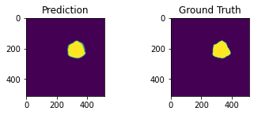

# Brain-Image-Segmentation

Segmentation of brain tissues in MRI image has a number of applications in diagnosis, surgical planning, and treatment of brain abnormalities. However, it is a time-consuming task to be performed by medical experts. In addition to that, it is challenging due to intensity overlap between the different tissues caused by the intensity homogeneity and artifacts inherent to MRI. Tominimize this effect, it was proposed to apply histogram based preprocessing. The goal of this project was to develop a robust and automatic segmentation of the human brain.

To tackle the problem, I have used a Convolutional Neural Network (CNN) based approach. U-net is one of the most commonly used and best-performing architecture in medical image segmentation. This moodel consists of the 2-D implementation of the U-Net.The performance was evaluated using Dice Coefficient (DSC).

### Dataset
This model was built for the following dataset: https://figshare.com/articles/brain_tumor_dataset/1512427

3064 T1-weighted contrast-inhanced images with three kinds of brain tumor are provided in the dataset.The three types of tumor are 

1.Glioma
2.Pituitary Tumor
3.Meningioma

### Model Architecture

The first half of the U-net is effectively a typical convolutional neural network like one would construct for an image classification task, with successive rounds of zero-padded ReLU-activated convolutions and ReLU-activated max-pooling layers. Instead of classification occurring at the "bottom" of the U, symmetrical upsampling and convolution layers are used to bring the pixel-wise prediction layer back to the original dimensions of the input image.

Here is the architecture for the 2D U-Net from the original publication mentioned earlier:

Here's an example of the correlation between my predictions in a single 2D plane:

:-------------------------:|:-------------------------:
   

   

Tips for improving model:

-The feature maps have been reduced so that the model will train using under 12GB of memory. If you have more memory to use, consider increasing the feature maps this will increase the complexity of the model (which will also increase its memory footprint but decrease its execution speed).
-If you choose a subset with larger tensors (e.g. liver or lung), it is recommended to add another maxpooling level (and corresponding upsampling) to the U-Net model. This will of course increase the memory requirements and decrease execution speed, but should give better results because it considers an additional recepetive field/spatial size.
-Consider different loss functions. The default loss function here is a binary_crossentropy. Different loss functions yield different loss curves and may result in better accuracy. However, you may need to adjust the learning_rate and number of epochs to train as you experiment with different loss functions. 
-Try exceuting other U-Net architectures in the model folders.

### Libraries Used
The code has been tested with the following configuration

- h5py == 2.10.0
- keras == 2.3.1
- scipy == 0.19.0
- sckit-learn == 0.18.1
- tensorflow == 2.2.0
- tgpu == NVIDIA Tesla K80 (Google Colab)

The UNet was based on this paper: https://arxiv.org/abs/1802.10508

